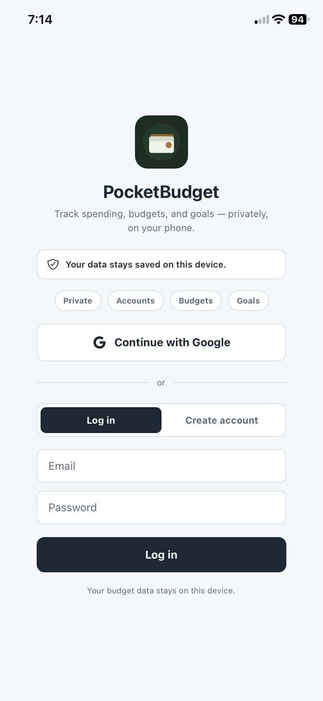
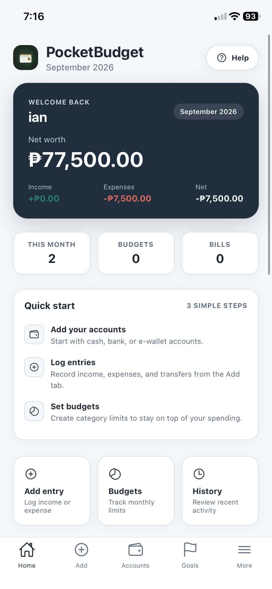
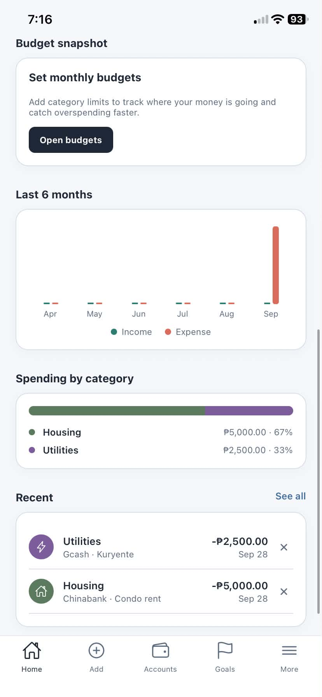
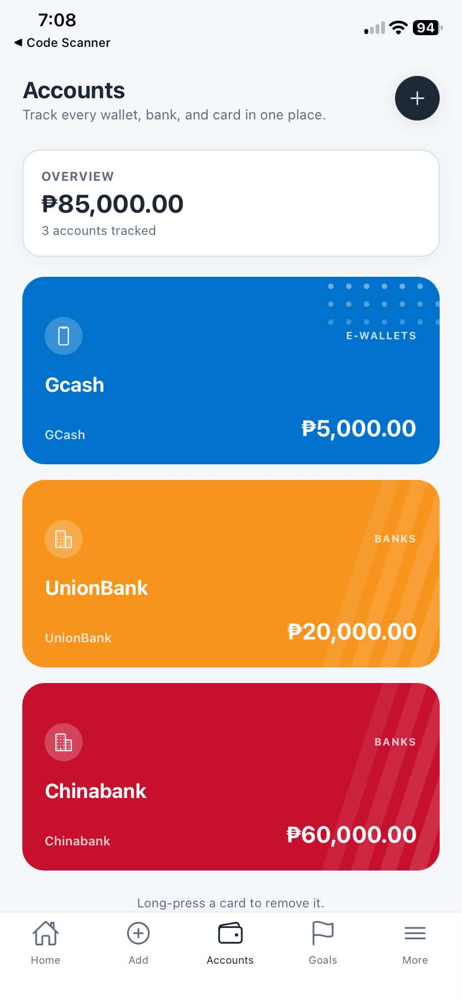
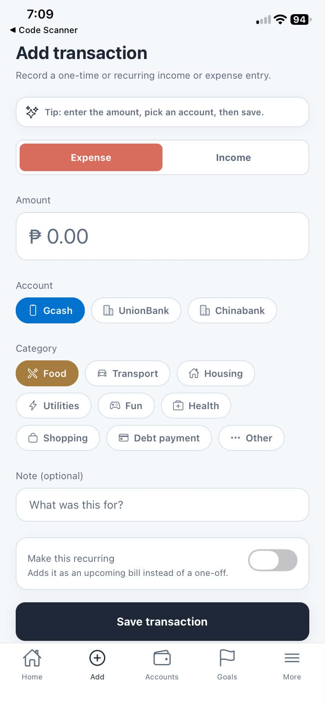
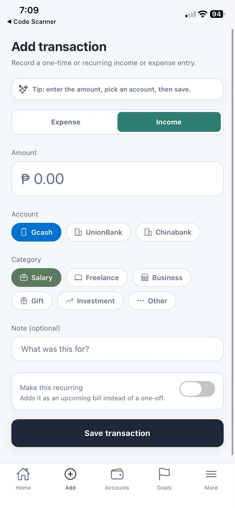
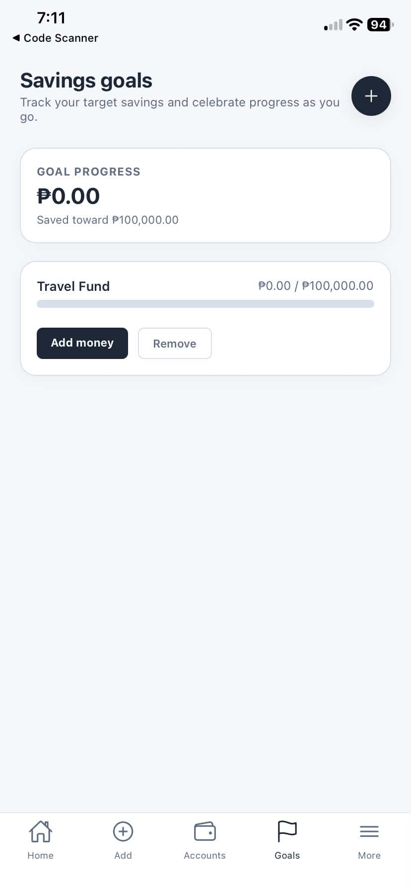
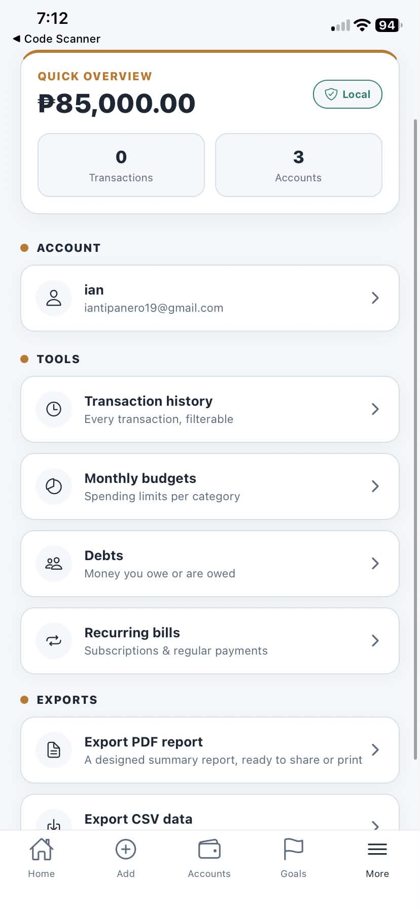
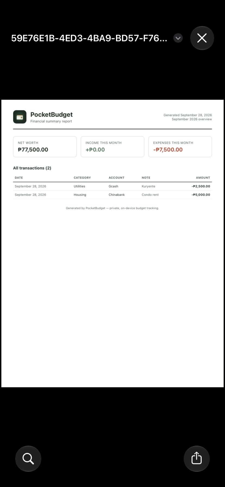

# PocketBudget

**A private, offline-first personal finance tracker for Android, built with React Native and Expo.**

Track income and expenses across cash, e-wallets, and bank accounts, set monthly budgets, save toward goals, keep tabs on debts, and get reminders for recurring bills. Your data stays on your phone.


---

## Screenshots

<table>
  <tr>
    <td align="center"><br/><sub>Login</sub></td>
    <td align="center"><br/><sub>Dashboard</sub></td>
    <td align="center"><br/><sub>Dashboard 2</sub></td>
  </tr>
  <tr>
    <td align="center"><br/><sub>Account cards</sub></td>
    <td align="center"><br/><sub>Add transaction</sub></td>
    <td align="center"><br/><sub>Add transaction 2</sub></td>
  </tr>
  <tr>
    <td align="center"><br /><sub>Savings goals</sub></td>
    <td align="center"><br /><sub>More menu</sub></td>
    <td></td>
  </tr>
</table>

<p align="center">
  <br />
  <sub>Exported PDF report</sub>
</p>

---

## Features

**Accounts and balances**
- Multiple accounts: cash, e-wallets (GCash, Maya, GoTyme, Coins.ph), Philippine banks (Landbank, BDO, BPI, Metrobank, UnionBank, Security Bank, PNB, Chinabank), cards, and savings
- Wallet-style cards on the Accounts screen, colored and textured per institution
- Live balances and net worth, calculated from your transactions

**Money tracking**
- Income and expense logging with separate category sets
- Monthly budgets per category, with an over-budget warning
- Savings goals with progress bars and contributions
- Debt tracker for money you owe and money owed to you
- Recurring bills and subscriptions, with a local reminder notification at 9 AM on the due date

**Insights and export**
- Dashboard with net worth, monthly income vs. expense, a 6-month trend chart, and spending by category
- Filterable transaction history
- Designed PDF report and raw CSV export, both shareable from the app

**Accounts and access**
- Sign in with Google (native) or create a local email/password account
- Login is required every time the app is launched fresh
- Each user's data is stored separately, so accounts on the same phone never see each other's data
- Profile screen with sign-out

---

## Tech stack

| Area | Tools |
| --- | --- |
| Framework | React Native, Expo SDK 57 |
| Navigation | React Navigation (bottom tabs + native stack) |
| Storage | AsyncStorage (on-device, namespaced per user) |
| Auth | `@react-native-google-signin/google-signin`, `expo-crypto` for local passwords |
| Reminders | `expo-notifications` (local scheduled notifications) |
| Reports | `expo-print` (HTML to PDF), `expo-sharing` |
| Build | EAS Build (Android APK) |

---

## Getting started

**Prerequisites:** Node.js 20.19.4 or newer, and the Expo Go app on your phone for quick testing.

```bash
git clone https://github.com/IannQt/pocketbudget-mobile-app.git
cd pocketbudget-mobile-app
npm install
npx expo install --fix
npx expo start
```

Scan the QR code with Expo Go.

> **Note:** Native Google Sign-In does not run inside Expo Go. In Expo Go, use "Create account" (email/password) to explore everything else. Google Sign-In works in the built APK.

### Set up Google Sign-In

1. In [Google Cloud Console](https://console.cloud.google.com), create a project and configure the OAuth consent screen.
2. Create an OAuth client ID of type **Web application** and copy its Client ID.
3. Paste it into `WEB_CLIENT_ID` in `context/AuthContext.js`.
4. Create an OAuth client ID of type **Android** with package name `com.pocketbudget.app` and the SHA-1 fingerprint from `eas credentials`.
5. Add any accounts that should be allowed to sign in as test users on the consent screen.

### Build the APK

```bash
npm install -g eas-cli
eas login
eas build --platform android --profile preview
```

The build runs on Expo's servers and returns a download link for the `.apk`.

---

## Project structure

```
App.js                      Login gate, tab and stack navigation
app.json / eas.json         Expo config and build profiles
assets/                     App icon, adaptive icon, splash icon
context/
  AuthContext.js            Google + local auth, session handling
  AppContext.js             All budget data and actions, per-user storage
screens/
  LoginScreen.js  HomeScreen.js  AddTransactionScreen.js
  AccountsScreen.js  GoalsScreen.js
  more/                     Profile, History, Budgets, Debts, Recurring
components/                 WalletCard, modals, pickers, charts, progress bars
utils/                      Categories/institutions, formatting, CSV, PDF, notifications
```

---

## Technical highlights

- **Per-user data isolation.** Storage keys include the user's ID, and the data provider remounts when the signed-in user changes, so switching accounts never leaks data.
- **Derived state instead of stored totals.** Balances, monthly totals, and category breakdowns are calculated from the raw transaction list, so they can't drift out of sync.
- **Defensive native module loading.** The Google Sign-In module is loaded inside a try/catch, so the app still runs in Expo Go, where that native module doesn't exist.
- **Self-updating reminders.** Whenever the recurring bills list changes, scheduled notifications are cleared and rebuilt to match.
- **Charts without a chart library.** The trend chart and category breakdown are built from plain `View` components.
- **Original card artwork.** Each institution's card uses its own color and a generic decorative pattern (dots, stripes, blobs), not any brand's logo.

---

## Privacy and security

Being upfront about what this app is and isn't:

- All budget data stays on the device. Nothing is uploaded anywhere.
- The app does **not** connect to real bank or e-wallet accounts. Balances are entered and tracked manually, and institutions are used as labels.
- Data is stored in AsyncStorage, which is not encrypted at rest.
- Local (email/password) accounts hash passwords with SHA-256 and no salt. That's acceptable for a device-local personal app, but it is not production-grade credential storage.
- Local accounts only work on the device where they were created, and there is no password recovery.

---

## Roadmap

- [ ] Transfers between accounts
- [ ] Encrypted storage and salted password hashing (`expo-secure-store`)
- [ ] Biometric app lock
- [ ] Multi-currency support
- [ ] Dark mode
- [ ] Optional cloud backup and sync
- [ ] Automated tests for the balance and budget calculations

---

## Disclaimer

PocketBudget is an independent personal project. It is **not affiliated with, endorsed by, or connected to** GCash, Maya, GoTyme, Coins.ph, Landbank, BDO, BPI, Metrobank, UnionBank, Security Bank, PNB, Chinabank, or any other institution mentioned. Institution names are used only as account labels, and the card designs are original.

---

Built by [Ian](https://github.com/IannQt).
